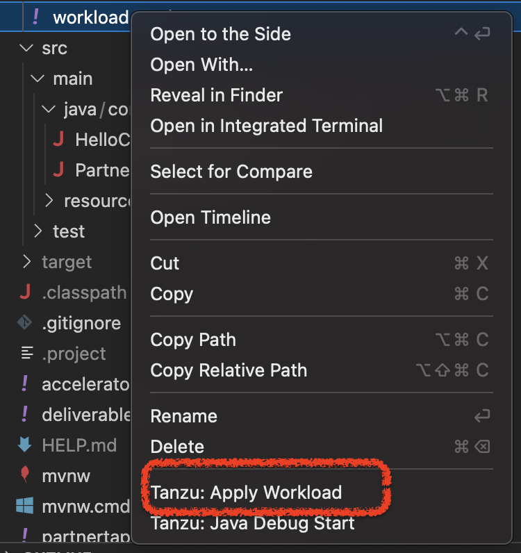

As we saw previously, Application Accelerator allows you to download your project template as a .zip file to your local machine, using the Web UI. Here, we are going to use a command-line tool to download the template to our workshop terminal session. The Tanzu CLI provides plugin features for working with Tanzu Application Platform. Let's download the project template:

```execute
tanzu accelerator generate {{ session_namespace }} --server-url https://accelerator.{{ ENV_VIEW_CLUSTER_DOMAIN }}
```

It was downloaded as a .zip file, so we'll need to unzip it:

```execute
unzip -o {{ session_namespace }}.zip
```

This is a Java web application, let's take a look at the source code:

```editor:open-file
file: {{ session_namespace }}/src/main/java/com/partnertapdemo/partnertapdemo/HelloController.java
```

With Learning Center, we are using the embedded Coder dev environment that runs in your browser. Of course, you can also code on your local machine using supported IDEs like Visual Studio Code and IntelliJ IDEA. Your scaffold code contains a **workload.yaml** file that can be used to deploy workload from VSCode with a single click. Look at the screenshot below:



But, Let's use another Developer Tooling in Tanzu Application Platform to run the application.

```editor:open-file
file: {{ session_namespace }}/Tiltfile
``` 

Tiltfile was generated by Application Accelerator as part of our project template. If you've never used Tilt before, this script may seem like a lot. Let's kick it off, and then we'll talk through what it's doing. You can right click on the Tiltfile in the code editor, and select `Tanzu: Live Update Start` in the pop-up menu. **Or**, you can click on the command below to accomplish the same thing.

```editor:execute-command
command: tanzu.liveUpdateStart
```

The Tiltfile script is going to deploy our application into our development environment, and it will take about 2.5 minutes to run to completion the first time. But don't worry! It is setting us up to run iterative deployments that will be much, much faster.


If you want to stop an auto update, Click to run below command:

```editor:execute-command
command: tanzu.liveUpdateStop
```
