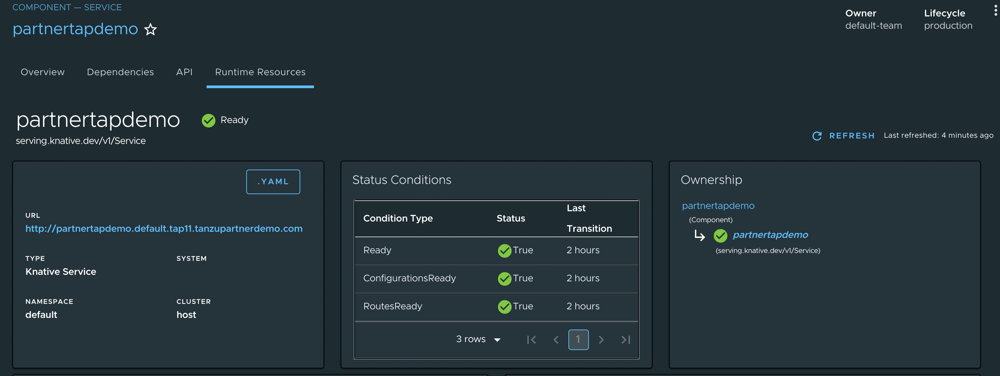
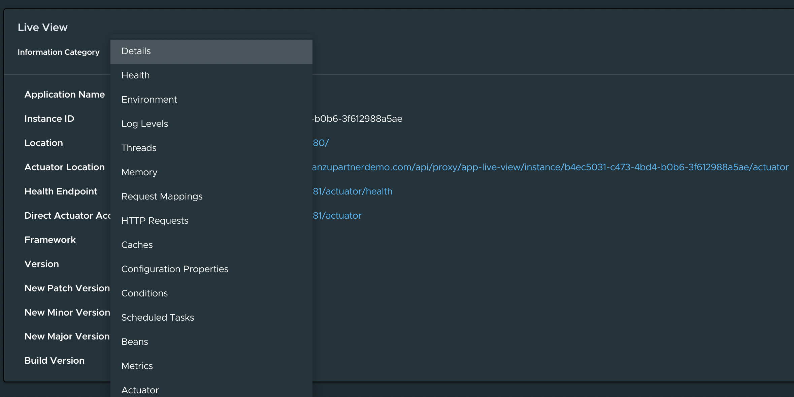

Sometimes an application isn't behaving quite like we'd expect after deployment, and we want to get more information about its runtime behavior, for diagnostics and troubleshooting. Is our application running out of memory? What was the response time for HTTP Requests?

Tanzu Application Platform provides Live View to help a developer like Cody gather that information. Let's take a look. We're going to access the Web UI known as TAP GUI, which can observe the deployment we just created:

```dashboard:open-url
url: https://tap-gui.{{ ENV_VIEW_CLUSTER_DOMAIN }}/catalog/default/component/partnertapdemo/workloads
```

Here we are looking at running deployments of `{{ session_namespace }}`, our application. There's a good chance that you see more than one deployment listed! That's because we are in a multitenant development environment, and different developers (or different workshop sessions) are each working on their own branch of the code. In a multi-tenant development cluster (also known as an Iterate cluster in TAP), each developer works in their own namespace for isolation.

Your developer namespace is **``tap-install``**. You can identify which `{{ session_namespace }}` app is yours by checking against the namespace column. Click on the {{ session_namespace }} hyperlink in the row that corresponds to your namespace. This will bring you to a detail view of your app:



If you scroll down in this screen, you will see the Kubernetes resources associated with your app. At the bottom of the screen, you'll find Pods. In Kubernetes, a Pod is where your application container runs. Your pod will have a long, funny name, click on it:


Scroll down a little bit, and you'll find our Live View pane. It has a menu drop-down called Information Category that allows you to navigate all sorts of data in your Application Runtime.



Explore for a little bit, there's a lot to see here. You can check out your application's environment variables, view thread stacktraces, see a graphical view of your memory consumption, see trace info on each HTTP request, and much more.

Live View is currently compatible with Spring Boot Java applications, and Steeltoe .NET Core applications.
