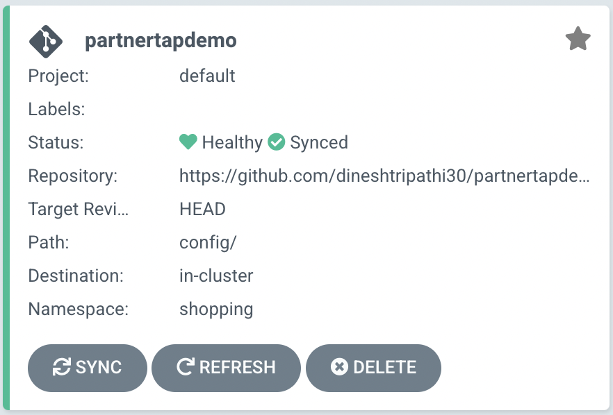

We now have a complete deployment specification for our application written to a GitOps repo, and that specification has been generated and vetted by our secure software supply chain. Alana the operator knows that the specification is safe to deploy, and she can verify that it is compliant with her company's governance policies.

The Kubernetes clusters where our application will ultimately run are known as Run clusters. Whereas our application was developed on a single Iterate cluster, and it was built on a single Build cluster, there may be numerous Run clusters where the application is deployed. For example, the application may be promoted to QA, Staging, and ultimately Production, and each of these environments will have their own Run cluster.

The role of the Run cluster is to simply read the deployment specification that was written to the GitOps repo, and apply these resources to Kubernetes (plus any environment-specific resources, like configuration).


Just as we created a **Workload** resource on the Build cluster to generate the supply chain for our application, we will create a **Deliverable** resource on the Run cluster, to instruct the Run cluster to sync with our GitOps repo. Let's preview the Deliverable:

```editor:open-file
file: /home/eduk8s/{{ session_namespace }}/deliverable.yaml
```

The deliverables are simple, they just contain identifiers for the application, and a reference to the same GitOps repo or an Image repo where they supply chain outputted to.

You know the drill by now: Alana isn't going to log directly into the Run clusters to create the deliverable. She will write the Deliverable to a GitOps repo, which will be synced to the Run cluster. Nobody ever has to directly access a sensitive environment like Production to schedule a deployment!


Now, the Run cluster is synced against the GitOps repo specified in the Deliverable. It will deploy our application, and when the supply chain updates the deployment specification, the Run cluster will sync to the new specification.

In this demo, **ArgoCD** is already deployed on a Kubernetes Cluster for the GitOps purpose. **Deliverable.yaml** file is written in a git repository and application is created/configured on the ArgoCD portal. e.g.



Open the ArgoCD UI to validate. Ask workshop administrator for the credentials.
```dashboard:open-url
url: https://argocd.tap.tanzupartnerdemo.com
```

Above application is configured to deploy in a separate namespace (usually it will be a separate TAP Run cluster). 
